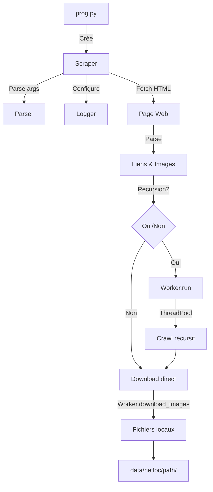

<div align="center">

# 🕷️ Arachnida

### _Mon scraper d'images png, jpg, gif et bmp_

<p align="center">
  
  
  
</p>

<p align="center">
  
  
  
</p>

<div align="center">
```
           ____                      ,
          /---.'.__             ____//
               '--.\           /.---'
          _______  \\         //
        /.------.\  \|      .'/  ______
       //  ___  \ \ ||/|\  //  _/_----.\__
      |/  /.-.\  \ \:|< >|// _/.'..\   '--'
         //   \'. | \'.|.'/ /_/ /  \\
        //     \ \_\/" ' ~\-'.-'    \\
       //       '-._| :H: |'-.__     \\
      //           (/'==='\)'-._\     ||
      ||                        \\    \|
      ||                         \\    '
      |/                          \\
```
</div>
</div>

---

## 📋 Table des matières

- [✨ Fonctionnalités](#-fonctionnalités)
- [🚀 Installation rapide](#-installation-rapide)
- [💻 Utilisation](#-utilisation)
- [⚙️ Options CLI](#️-options-cli)
- [📊 Exemple de sortie](#-exemple-de-sortie)
- [🏗️ Architecture](#️-architecture)
- [📁 Structure du projet](#-structure-du-projet)
- [🔧 Configuration avancée](#-configuration-avancée)
- [📝 Logging](#-logging)
- [⚠️ Avertissements](#️-avertissements)
- [❓ FAQ](#-faq)
- [🤝 Contribution](#-contribution)
- [📄 Licence](#-licence)

---

## ✨ Fonctionnalités

<div align="center">

| Fonctionnalité | Description |
|:---:|:---|
| 🔄 | **Crawling récursif** avec profondeur configurable |
| ⚡ | **Multi-threading** pour des téléchargements rapides |
| 🎯 | **Détection intelligente** des duplicatas |
| 📊 | **Barres de progression** élégantes avec `tqdm` |
| 📝 | **Logging complet** (fichier + console) |
| 🎨 | **Interface CLI** intuitive avec ASCII art |
| 🔍 | **Filtrage automatique** des formats d'image (.jpg, .png, .gif, .bmp) |
| 💾 | **Organisation hiérarchique** des téléchargements |

</div>

---

## 🚀 Installation rapide

### Prérequis

- **Python 3.8+** recommandé
- `pip` pour installer les dépendances

### Étapes

```bash
# Cloner le repository
git clone https://github.com/monsieurCanard/Arachnida.git
cd Arachnida

# Installer les dépendances
python3 -m pip install -r requirements.txt

# Ou installer manuellement
python3 -m pip install requests tqdm
```

> 💡 **Astuce** : Utilisez un environnement virtuel pour isoler les dépendances
> ```bash
> python3 -m venv .venv
> source .venv/bin/activate  # Linux/macOS
> # .venv\Scripts\activate    # Windows
> ```

---

## 💻 Utilisation

### Commande de base

```bash
dist/Spider <URL> [OPTIONS]
```

### 📖 Exemples pratiques

<details>
<summary>🔹 <b>Crawl simple (sans récursivité)</b></summary>

```bash
dist/Spider https://example.com
```
</details>

<details>
<summary>🔹 <b>Crawl récursif avec profondeur limitée</b></summary>

```bash
dist/Spider https://example.com -r -l 2
```
</details>

<details>
<summary>🔹 <b>Personnaliser le dossier de destination</b></summary>

```bash
dist/Spider https://example.com -p my_images
```
</details>

<details>
<summary>🔹 <b>Activer les logs détaillés</b></summary>

```bash
dist/Spider https://example.com --log DEBUG
```
</details>

<details>
<summary>🔹 <b>Configuration complète</b></summary>

```bash
dist/Spider https://example.com \
  -r \
  -l 3 \
  -p downloads/images \
  --log INFO
```
</details>

---

## ⚙️ Options CLI

| Option | Raccourci | Type | Défaut | Description |
|:---:|:---:|:---:|:---:|:---|
| `url` | - | `string` | **requis** | 🌐 URL cible à scraper |
| `--recurse` | `-r` | `flag` | `False` | 🔄 Activer le crawling récursif |
| `--level` | `-l` | `int` | `5` | 📊 Profondeur de récursion (1-10) |
| `--path` | `-p` | `string` | `data` | 📁 Dossier de destination |
| `--log` | - | `string` | `None` | 📝 Niveau de log (`DEBUG`, `INFO`, `WARNING`, `ERROR`, `CRITICAL`) |

> ⚠️ **Note** : Si aucun schéma n'est fourni dans l'URL, `https://` est automatiquement ajouté.

---

## 📊 Exemple de sortie

<!-- <details>
<summary>Cliquez pour voir un exemple complet d'exécution</summary> -->

```bash
2025-11-22 09:19:32,485 [INFO] Arachnida Spider started.
    ========================================
          Arachnida - Web Scraper
    ========================================
           ____                      ,
          /---.'.__             ____//
               '--.\           /.---'
          _______  \\         //
        /.------.\  \|      .'/  ______
       //  ___  \ \ ||/|\  //  _/_----.\__
      |/  /.-.\  \ \:|< >|// _/.'..\   '--'
         //   \'. | \'.|.'/ /_/ /  \\
        //     \ \_\/" ' ~\-'.-'    \\
       //       '-._| :H: |'-.__     \\
      //           (/'==='\)'-._\     ||
      ||                        \\    \|
      ||                         \\    '
      |/                          \\
                                   ||
                                   ||
                                   \\
    ========================================
        TARGET URL: https://example.com
        RECURSION: True
        DEPTH LEVEL: 2
    ========================================
        LET'S GET ALL THE IMAGES!
    ++++++++++++++++++++++++++++++++++++++++

2025-11-22 09:19:32,486 [INFO] Fetching main page: https://example.com
2025-11-22 09:19:32,691 [INFO] Found 6 images and 461 links on the page.
2025-11-22 09:19:32,726 [INFO] Starting crawl with recursion level 2.

# Phase de crawling
Spider charging caffeine… crawling faster…: 100%|████████████| 461/461 [00:42<00:00, 10.9it/s]

                     Total images to download: 123 images.
                     Do you want to download the images? (y/n): y

                     Starting image download...

# Phase de téléchargement
Negotiating with TCP like it's a hostage situation.: 100%|████████| 123/123 [00:22<00:00, 5.45it/s]

    ========================================
          Arachnida - Scraping Complete
    ========================================
    ++ 120 downloaded ( ~ 8.54 MB)
    -----------------------------------
    -- 3 duplicates
    -----------------------------------
    -- 0 errors.
    -----------------------------------
    ===================================
      Spider returning to the shadows…
            As all spiders do.
    ===================================
```

<!-- </details> -->

---

## 🏗️ Architecture



### 🔄 Flux d'exécution

1. **Initialisation** : Création de l'objet `Scraper` et parsing des arguments CLI
2. **Configuration** : Setup du logger et du `ThreadPoolExecutor`
3. **Fetch** : Récupération de la page HTML principale
4. **Parsing** : Extraction des liens et images via `HTMLParser`
5. **Crawling** : *(optionnel)* Parcours récursif des liens trouvés
6. **Download** : Téléchargement multi-threadé des images
7. **Rapport** : Affichage des statistiques finales

---

## 📁 Structure du projet

```
Arachnida/
├── 📄 README.md                 # Ce fichier
├── 📄 requirements.txt          # Dépendances Python
├── 📄 spider.log                # Logs d'exécution (généré)
├── 📂 Spider/                   # Code source
│   ├── 🐍 prog.py              # Point d'entrée principal
│   ├── 🐍 Scraper.py           # Logique du scraper
│   ├── 🐍 Parser.py            # Parsing HTML + CLI args
│   ├── 🐍 Worker.py            # Tâches threadées
│   ├── 🐍 Logger.py            # Configuration logging
│   ├── 🐍 utils.py             # Fonctions utilitaires
│   └── 🐍 print.py             # Bannières ASCII
└── 📂 data/                     # Images téléchargées (généré)
    └── 📂 <netloc>/
        └── 📂 <path>/
            └── 🖼️ image.jpg
```

---

## 🔧 Configuration avancée

### 🎨 Personnaliser les messages de progression

Éditez `prog.py` (lignes 15-22) pour modifier les descriptions des barres `tqdm` :

```python
progress_bar_desc = [
    "Votre message personnalisé 1",
    "Votre message personnalisé 2",
    "Votre message personnalisé 3"
]
```

### 📝 Logging

Le logger écrit simultanément dans :
- **Fichier** : `spider.log` (niveau `DEBUG` - tout est enregistré)
- **Console** : stdout (niveau `INFO` - messages importants uniquement)

#### Configuration dans `Logger.py`

```python
# File handler - enregistre tout
fh = logging.FileHandler("spider.log")
fh.setLevel(logging.DEBUG)

# Stream handler - affiche INFO+
sh = logging.StreamHandler()
sh.setLevel(logging.INFO)
```

#### Utilisation

```bash
# Logs normaux (INFO)
dist/Spider https://example.com --log INFO

# Logs détaillés (DEBUG)
dist/Spider https://example.com --log DEBUG

# Logs minimaux (WARNING)
dist/Spider https://example.com --log WARNING
```

---

## ⚠️ Avertissements

> 🚨 **Important** : Utilisez Arachnida de manière responsable

| ⚠️ | Considération |
|:---:|:---|
| 🤖 | Respectez le fichier `robots.txt` des sites web |
| ⏱️ | Évitez de surcharger les serveurs avec trop de requêtes |
| 📜 | Vérifiez les conditions d'utilisation des sites cibles |
| 🔒 | Certains sites peuvent bloquer les scrapers |
| ⚖️ | Assurez-vous d'avoir le droit de télécharger le contenu |

### Limitations connues

- ⏳ Timeout par défaut : 5 secondes (peut être insuffisant pour certains serveurs)
- 🔄 Gestion d'erreurs basique (pas de retry automatique)
- 📸 Détection de duplicatas basée uniquement sur le chemin du fichier

---

<div align="center">

### 💖 Merci d'utiliser Arachnida !

<p align="center">
  
  
</p>

**Si ce projet vous a été utile, n'hésitez pas à lui donner une ⭐ !**

[⬆ Retour en haut](#-arachnida)

</div>

